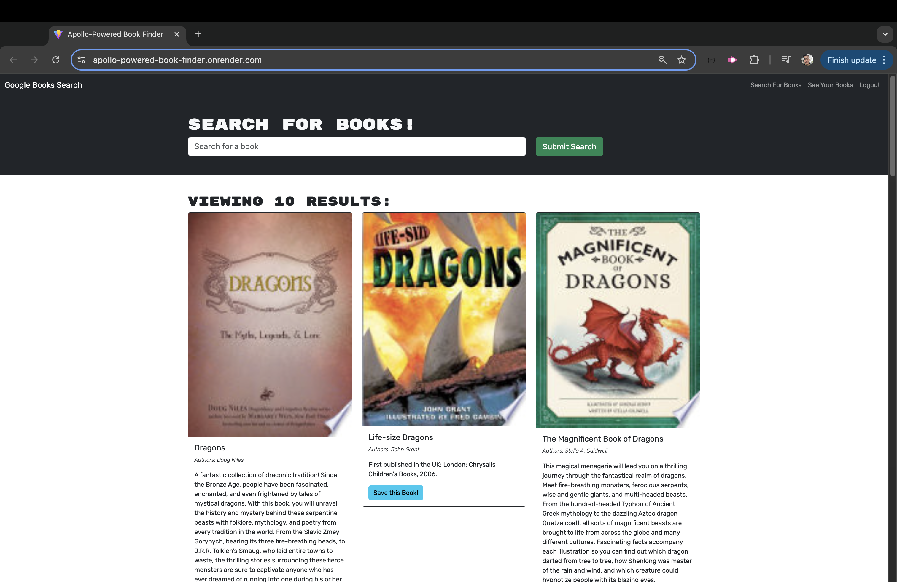

# Apollo-Powered Book Finder

[](https://github.com/Thecaprifire)
[](https://choosealicense.com/licenses/mit/)


## Description:
The Apollo-Powered Book Finder is a robust book search engine built with the MERN stack, which includes MongoDB, Express.js, React, and Node.js. This project refactors an existing Google Books API search engine, transforming it from a RESTful API to a GraphQL API utilizing Apollo Server.


 ## Table of Contents
  * [Description](#description)
  * [The Challenge](#the-challenge)
  * [User Story](#user-story)
  * [Acceptance Criteria](#acceptance-criteria)
  * [Installation Process](#installation-process)
  * [Actual Website Link](#actual-website-link)
  * [Screenshots](#screenshots)
  * [Resources](#resources)
  * [Questions](#questions)
  * [License](#license)


  ## The Challenge:
Create a fully functioning Google Books API search engine built with a RESTful API, and refactor it to be a GraphQL API built with Apollo Server. 


## User Story
```md
AS AN avid reader
I WANT to search for new books to read
SO THAT I can keep a list of books to purchase
```


## Acceptance Criteria
```md
GIVEN a book search engine
WHEN I load the search engine
THEN I am presented with a menu with the options Search for Books and Login/Signup and an input field to search for books and a submit button
WHEN I click on the Search for Books menu option
THEN I am presented with an input field to search for books and a submit button
WHEN I am not logged in and enter a search term in the input field and click the submit button
THEN I am presented with several search results, each featuring a book’s title, author, description, image, and a link to that book on the Google Books site
WHEN I click on the Login/Signup menu option
THEN a modal appears on the screen with a toggle between the option to log in or sign up
WHEN the toggle is set to Signup
THEN I am presented with three inputs for a username, an email address, and a password, and a signup button
WHEN the toggle is set to Login
THEN I am presented with two inputs for an email address and a password and login button
WHEN I enter a valid email address and create a password and click on the signup button
THEN my user account is created and I am logged in to the site
WHEN I enter my account’s email address and password and click on the login button
THEN I the modal closes and I am logged in to the site
WHEN I am logged in to the site
THEN the menu options change to Search for Books, an option to see my saved books, and Logout
WHEN I am logged in and enter a search term in the input field and click the submit button
THEN I am presented with several search results, each featuring a book’s title, author, description, image, and a link to that book on the Google Books site and a button to save a book to my account
WHEN I click on the Save button on a book
THEN that book’s information is saved to my account
WHEN I click on the option to see my saved books
THEN I am presented with all of the books I have saved to my account, each featuring the book’s title, author, description, image, and a link to that book on the Google Books site and a button to remove a book from my account
WHEN I click on the Remove button on a book
THEN that book is deleted from my saved books list
WHEN I click on the Logout button
THEN I am logged out of the site and presented with a menu with the options Search for Books and Login/Signup and an input field to search for books and a submit button  
```


## Installation Process
1. Clone the Repository:
    -   Clone the project repository to your local machine by running:
        `git clone https://github.com/Thecaprifire/apollo-powered-book-finder`
    -   Navigate into the project directory:
        `cd apollo-powered-book-finder`
2.	Set Up Environment Variables:
	-	Create a .env file in the root directory of the project.
	-	Add your MongoDB connection string from your MongoDB Atlas account to the .env file, following this format:
        `MONGODB_URI=your_mongodb_connection_string_here`
3. Open Integrated Terminal:
    -   Launch an integrated terminal from your preferred code editor (e.g., VSCode).
4. Install Dependencies:
    -   Install the essential packages to initialize the application by running:
        `npm install`
    -   The key packages used include:
        - Client Dependencies:
            -   React: [Version 18.2.0](https://www.npmjs.com/package/react)
            -   React DOM: [Version 18.2.0](https://www.npmjs.com/package/react-dom)
            -   React Router DOM: [Version 6.11.2](https://www.npmjs.com/package/react-router-dom)
            -   Apollo Client: [Version 3.11.8](https://www.npmjs.com/package/@apollo/client)
            -   GraphQL: [Version 16.9.0](https://www.npmjs.com/package/graphql)
	        -   Bootstrap: [Version 5.2.3](https://www.npmjs.com/package/bootstrap)
	        -   jwt-decode: [Version 3.1.2](https://www.npmjs.com/package/jwt-decode)
        - Server Dependencies:
	        -	@apollo/server: [Version 4.11.0](https://www.npmjs.com/package/@apollo/server)
	        -	Bcrypt: [Version 4.0.1](https://www.npmjs.com/package/bcrypt)
	        -	Express: [Version 4.17.1](https://www.npmjs.com/package/express)
	        -	GraphQL: [Version 16.9.0](https://www.npmjs.com/package/graphql)
	        -	Jsonwebtoken: [Version 8.5.1](https://www.npmjs.com/package/jsonwebtoken)
	        -	Mongoose: [Version 8.0.0](https://www.npmjs.com/package/mongoose)
        - Development Dependencies:
            -   Vite: [Version 5.1.6](https://www.npmjs.com/package/vite)
            -   ESLint: [Version 8.38.0](https://www.npmjs.com/package/eslint)
		    -   Nodemon: [Version 2.0.3](https://www.npmjs.com/package/nodemon)
		    -   Concurrently: [Version 8.2.0](https://www.npmjs.com/package/concurrently)
5. Build the Application:
    -   Generate the production build by running:
          `npm run build`
6. Preview the Application:
    -   Preview the production build to ensure everything is working correctly:
           `npm run preview`
7. Start the Development Server:
    -   Launch both the server and the client in development mode by running:
            `npm run develop`
8. Test the Application:
    -   Open your browser and navigate to http://localhost:3000 (or the port specified by Vite) to test and view the application.
    -   Ensure both the server and client are running for the application to function correctly.


## Actual Website Link:
[Apollo-Powered Book Finder](https://apollo-powered-book-finder.onrender.com)


## Screenshots:
### Figure 1.
 
### Figure 2.
 
### Figure 3.
 
### Figure 4.
 


## Resources
 - Client Dependencies:
    -   React: [Version 18.2.0](https://www.npmjs.com/package/react)
    -   React DOM: [Version 18.2.0](https://www.npmjs.com/package/react-dom)
    -   React Router DOM: [Version 6.11.2](https://www.npmjs.com/package/react-router-dom)
    -   Apollo Client: [Version 3.11.8](https://www.npmjs.com/package/@apollo/client)
    -   GraphQL: [Version 16.9.0](https://www.npmjs.com/package/graphql)
	-   Bootstrap: [Version 5.2.3](https://www.npmjs.com/package/bootstrap)
	-   jwt-decode: [Version 3.1.2](https://www.npmjs.com/package/jwt-decode)
- Server Dependencies:
	-	@apollo/server: [Version 4.11.0](https://www.npmjs.com/package/@apollo/server)
	-	Bcrypt: [Version 4.0.1](https://www.npmjs.com/package/bcrypt)
	-	Express: [Version 4.17.1](https://www.npmjs.com/package/express)
	-	GraphQL: [Version 16.9.0](https://www.npmjs.com/package/graphql)
	-	Jsonwebtoken: [Version 8.5.1](https://www.npmjs.com/package/jsonwebtoken)
	-	Mongoose: [Version 8.0.0](https://www.npmjs.com/package/mongoose)
- Development Dependencies:
    -   Vite: [Version 5.1.6](https://www.npmjs.com/package/vite)
    -   ESLint: [Version 8.38.0](https://www.npmjs.com/package/eslint)
	-   Nodemon: [Version 2.0.3](https://www.npmjs.com/package/nodemon)
	-   Concurrently: [Version 8.2.0](https://www.npmjs.com/package/concurrently)


 ## Questions
  Contact the author with any questions!<br>
  Github link: [Thecaprifire](https://github.com/Thecaprifire)<br>
  Email: ianjandaluz@gmail.com


## License
  This project is [MIT](https://choosealicense.com/licenses/mit/) licensed.<br />

  Copyright © 2024 [JAN IAN DALUZ](https://github.com/Thecaprifire)
  
  <hr>
  <p align='center'><i>
  Here’s to your coding journey! 🎉 JAN IAN DALUZ
  </i></p>